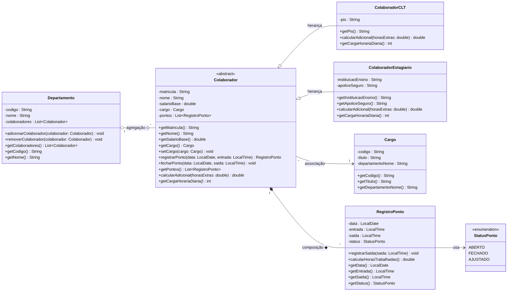

# 🏢 RH PontoCerto — Sistema de Ponto e Gestão de Colaboradores

> **Projeto 18 — RH: Ponto e Colaboradores**  
> Disciplina: Programação Orientada a Objetos / Modelagem de Software  
> Professor: Luís Carlos dos Santos Júnior  

---

## 📖 1. Mini Documento Explicativo do Projeto

O **RH PontoCerto** é um sistema desenvolvido para gerenciar colaboradores, seus departamentos, cargos e o controle rigoroso da folha de ponto (registro de entradas e saídas diárias).

O sistema resolve o problema central de controle de jornada em empresas médias, garantindo a integridade dos dados registrados, impedindo marcações inconsistentes (como saídas registradas antes das entradas) e calculando regras específicas de jornada e adicionais conforme o tipo de contratação de cada profissional.

---

## 🏛️ 2. Aplicação dos 4 Pilares da Orientação a Objetos

1. **Abstração (`Colaborador`)**:
   - A classe `Colaborador` define o modelo conceitual geral de um funcionário (matrícula, nome, salário base, cargo e lista de pontos). Como todo colaborador na prática é contratado sob um regime específico, a classe `Colaborador` é abstrata (`abstract`) e define métodos abstratos como `calcularAdicional(double horasExtras)` e `getCargaHorariaDiaria()`.

2. **Herança (`extends`)**:
   - As classes especializadas `ColaboradorCLT` e `ColaboradorEstagiario` herdam todos os atributos e comportamentos comuns da classe pai `Colaborador`, reaproveitando código e estabelecendo a relação de *"é um"* (`ColaboradorCLT` é um `Colaborador`).

3. **Polimorfismo (`@Override`)**:
   - A operação `calcularAdicional(double horasExtras)` se comporta de maneira diferente para cada subclasse:
     - **`ColaboradorCLT`**: Calcula o valor da hora extra com adicional legal de 50% sobre o valor da hora normal.
     - **`ColaboradorEstagiario`**: Não recebe hora extra por determinação da Lei do Estágio (retorna 0.0 e mantém jornada máxima de 6 horas diárias).

4. **Encapsulamento**:
   - Todos os atributos são privados (`private`), acessados unicamente por métodos de leitura (`getters`) e modificados apenas através de operações de negócio controladas.
   - **Proteção de Invariantes**: A classe `RegistroPonto` garante que a saída nunca ocorra antes da entrada no mesmo dia e que o status do ponto evolua de forma estrita (`ABERTO` $\rightarrow$ `FECHADO`).

---

## 🔗 3. Mapeamento da Entrevista para o Modelo (Relacionamentos)

| Na fala do cliente / entrevista | Elemento no Modelo | Tipo de Relação |
|---|---|---|
| "Colaborador tem dois tipos: CLT e Estagiário" | `Colaborador` $\rightarrow$ `ColaboradorCLT`, `ColaboradorEstagiario` | **Herança** (`<|--`) |
| "Colaborador ◆ RegistroPonto (nasce e morre junto)" | `Colaborador` possui seus `RegistroPonto` | **Composição** (`*--`) |
| "Departamento ◇ Colaborador (apenas agrupa)" | `Departamento` agrupa `Colaborador` | **Agregação** (`o--`) |
| "Colaborador possui um Cargo" | `Colaborador` referencia `Cargo` | **Associação** (`-->`) |

---

## 📐 4. Diagrama de Classes (Mermaid)



---

## 💻 5. Como Executar o Código Java

1. Navegue até a pasta `java/src`:
   ```bash
   cd java/src
   ```
2. Compile os arquivos Java:
   ```bash
   javac br/com/pontocerto/model/*.java br/com/pontocerto/app/*.java
   ```
3. Execute a classe principal:
   ```bash
   java br.com.pontocerto.app.Main
   ```
