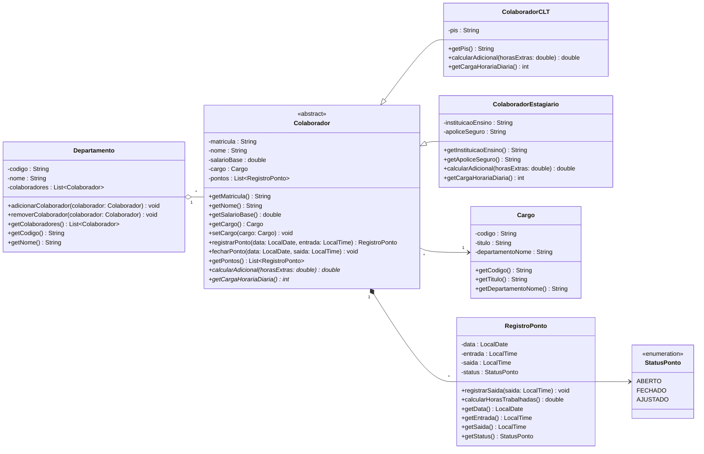

# Sistema de RH - Controle de Ponto e Colaboradores

## Integrantes
- Felipe Gabriel Boccardo de Brito de Jesus - RA: 3024103228

## Sobre o Projeto
Sistema para gerenciamento de colaboradores, departamentos e controle de ponto da empresa. O sistema permite o cadastro de colaboradores sob regimes CLT e Estágio, alocação em departamentos e cargos, além de registrar as marcações de entrada e saída diárias com validação de horários e cálculo de adicionais de horas trabalhadas.

## Diagrama de Classes

