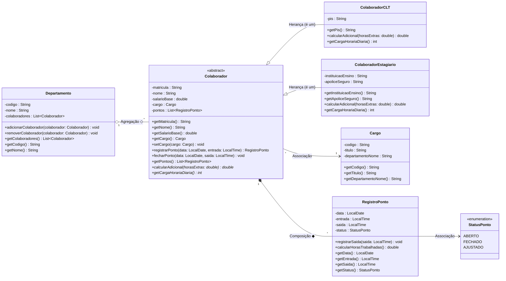

# 📐 Modelagem do Sistema RH PontoCerto

Este documento contém o Diagrama de Classes UML do sistema **RH PontoCerto**, especificando todos os atributos, métodos, visibilidades, multiplicidades e tipos de relacionamentos.

---

## 📊 Diagrama de Classes UML (Mermaid)

---

## 📌 Guia de Leitura dos Relacionamentos

- **Herança (`──▷` / `<|--`)**: `ColaboradorCLT` e `ColaboradorEstagiario` herdam de `Colaborador`.
- **Composição (`◆` / `*--`)**: `Colaborador` compõe `RegistroPonto`. O registro de ponto não existe sem o colaborador proprietário.
- **Agregação (`◇` / `o--`)**: `Departamento` agrega `Colaborador`. Se o departamento for extinto, os colaboradores continuam existindo.
- **Associação (`-->`)**: `Colaborador` referencia seu `Cargo` e `RegistroPonto` referencia `StatusPonto`.
- **Visibilidade**:
  - `-` = Privado (`private`)
  - `+` = Público (`public`)
  - `*` = Método Abstrato (`abstract`)
